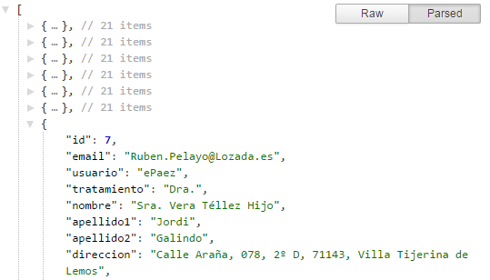

## Chrome. Extensiones para desarrollo web

### JSON Formatter

 Para visualizar el contenido de variables json.
 
 Muestra un botón para ver el contenido en formato Raw y otro que te permite desplegar o contraer los distintos niveles del json.
 
 

 https://chrome.google.com/webstore/detail/json-formatter/bcjindcccaagfpapjjmafapmmgkkhgoa/related?hl=en
 
### JetBrains IDE Support

 Permite depurar aplicaciones PHP desde PhpStorm.
 
 https://chrome.google.com/webstore/detail/jetbrains-ide-support/hmhgeddbohgjknpmjagkdomcpobmllji
 
### Form Templates

 Permite grabar los datos de los formularios html y volverlos a rellenar con los mismos datos para poderlos probar varias veces.

 También tiene una opción para rellenar con datos aleatorios un formulario.

 https://chrome.google.com/webstore/detail/form-templates/nnlhpmkdmolhbkbnmiambphhkepekomh